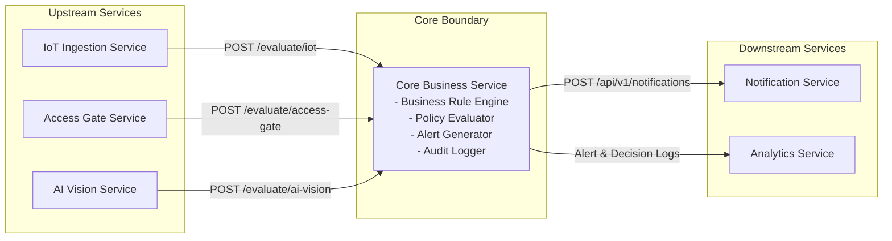

# Service Boundary - Core Business Service

## 1. Tên Service
- **Tên dịch vụ:** Core Business Service (Dịch vụ Xử lý Nghiệp vụ Trung tâm)
- **Mã dịch vụ:** `core-business-service`
- **Sản phẩm:** Smart Campus Operations Platform (Product A / Product B)

## 2. Bài toán Service giải quyết
Core Business Service là dịch vụ trung tâm đóng vai trò là "bo mạch chủ" / "bộ não" xử lý luật nghiệp vụ (Business Rule Engine) cho toàn bộ hệ thống Smart Campus. Service tiếp nhận các sự kiện và dữ liệu từ các dịch vụ thu thập đầu vào (IoT Ingestion, Access Gate, AI Vision), áp dụng các chính sách/quy tắc nghiệp vụ (Policies/Rules) để đánh giá tính hợp lệ, phát hiện bất thường, ra quyết định tạo Cảnh báo (Alert), sau đó chuyển giao cảnh báo cho Notification Service và cung cấp dữ liệu quyết định cho Analytics Service.

## 3. Actor
- **System Actors (Upstream Systems):**
  - `IoT Ingestion Service`: Gửi dữ liệu đo đạc từ các cảm biến (nhiệt độ, độ ẩm, chuyển động).
  - `Access Gate Service`: Gửi dữ liệu sự kiện quẹt thẻ / truy cập cổng ra vào.
  - `AI Vision Service`: Gửi kết quả phát hiện đối tượng / bất thường từ hình ảnh camera.
- **System Actors (Downstream Systems):**
  - `Notification Service`: Nhận lệnh và thông tin cảnh báo để phát đi qua các kênh (Telegram, Email, Webhook).
  - `Analytics Service`: Truy vấn/nhận dữ liệu cảnh báo và lịch sử quyết định để tổng hợp báo cáo.
- **Human Actors:**
  - `Campus Security Officer / Admin`: Quản lý, cấu hình quy tắc nghiệp vụ (Rules/Policies) và theo dõi danh sách cảnh báo trung tâm.

## 4. Responsibility
- **Sở hữu và quản lý Quy tắc nghiệp vụ (Business Rules):** Lưu trữ và thực thi các luật nghiệp vụ (ví dụ: nhiệt độ vượt 35°C, quẹt thẻ ngoài giờ 22h-05h, phát hiện người lạ trong khu vực cấm...).
- **Đánh giá & Xử lý sự kiện (Event Evaluation):** Nhận sự kiện từ các upstream services, đối chiếu với danh sách quy tắc nghiệp vụ đang kích hoạt.
- **Ra quyết định Cảnh báo (Alert Decision & Generation):** Tạo bản ghi cảnh báo với đầy đủ định danh (`alert_id`), loại bất thường (`type`), mức độ nghiêm trọng (`severity`: `low`, `medium`, `high`, `critical`) và thông điệp chi tiết.
- **Chuyển tiếp Cảnh báo (Alert Dispatch):** Đẩy thông tin cảnh báo sang `Notification Service`.
- **Lưu trữ nhật ký quyết định (Decision & Alert Audit Logging):** Lưu vết toàn bộ các sự kiện đã xử lý và quyết định được đưa ra.
- **Cung cấp API quản trị & thống kê:** Cung cấp endpoint để cấu hình luật nghiệp vụ và truy vấn danh sách cảnh báo.

## 5. Out of scope
- **Không** trực tiếp kết nối, quản lý hay đọc dữ liệu từ thiết bị phần cứng (cảm biến ESP32, đầu đọc thẻ RFID, camera IP) -> Trách nhiệm của `IoT Ingestion`, `Access Gate`, `Camera Stream`.
- **Không** thực hiện xử lý ảnh, chạy mô hình AI/YOLO hay nhận diện khuôn mặt -> Trách nhiệm của `AI Vision Service`.
- **Không** trực tiếp gửi tin nhắn Telegram, Email, Discord hay quản lý retry/gửi trùng thông báo -> Trách nhiệm của `Notification Service`.
- **Không** tính toán tổng hợp báo cáo chuỗi thời gian, vẽ biểu đồ hay đo lường metric tổng thể -> Trách nhiệm của `Analytics Service`.

## 6. Input

| Field | Type | Required | Ý nghĩa | Nguồn |
|---|---|---|---|---|
| `device_id` | string | No | Mã định danh thiết bị IoT | IoT Ingestion |
| `temperature` | float | No | Giá trị nhiệt độ đo được (°C) | IoT Ingestion |
| `humidity` | float | No | Giá trị độ ẩm đo được (%) | IoT Ingestion |
| `motion` | boolean | No | Trạng thái phát hiện chuyển động (`true`/`false`) | IoT Ingestion |
| `card_id` | string | No | Mã thẻ RFID / mã truy cập quẹt thẻ | Access Gate |
| `gate_id` | string | No | Mã cổng ra vào (VD: `gate-main`, `gate-lab-01`) | Access Gate |
| `direction` | string | No | Hướng ra vào (`IN` / `OUT`) | Access Gate |
| `person_id` | string | No | Mã định danh cá nhân / Sinh viên | Access Gate |
| `camera_id` | string | No | Mã camera ghi nhận | AI Vision |
| `detected` | boolean | No | Trạng thái AI phát hiện đối tượng (`true`/`false`) | AI Vision |
| `object` | string | No | Loại đối tượng phát hiện (`person`, `stranger`, `vehicle`...) | AI Vision |
| `confidence` | float | No | Mức độ tin cậy từ AI (0.0 - 1.0) | AI Vision |
| `risk_level` | string | No | Mức độ rủi ro do AI đánh giá (`low`, `medium`, `high`) | AI Vision |
| `timestamp` | string (ISO8601) | Yes | Thời gian xảy ra sự kiện gốc | Upstream Services |

## 7. Output
- **Payload Cảnh báo (Alert Object)** gửi sang Notification Service / Analytics Service:
  ```json
  {
    "alert_id": "ALT-2026-001",
    "source_service": "access_gate",
    "type": "unauthorized_access",
    "severity": "high",
    "message": "Quẹt thẻ ngoài giờ cho phép tại gate-lab-01",
    "details": {
      "card_id": "RFID-2026-001",
      "gate_id": "gate-lab-01",
      "person_id": "SV001"
    },
    "timestamp": "2026-08-11T22:30:00Z"
  }
  ```
- **Response kết quả đánh giá API:** Trả về HTTP 200/201 kèm trạng thái đánh giá (`processed`, `alert_generated`: `true`/`false`).

## 8. Provider / Consumer
- **Provider (Nguồn cung cấp dữ liệu cho Core Business Service):**
  - `IoT Ingestion Service` (cung cấp sự kiện cảm biến)
  - `Access Gate Service` (cung cấp sự kiện ra vào)
  - `AI Vision Service` (cung cấp sự kiện phân tích hình ảnh)
- **Consumer (Nơi tiêu thụ dữ liệu do Core Business Service tạo ra):**
  - `Notification Service` (tiêu thụ Alert payload để gửi cảnh báo)
  - `Analytics Service` (tiêu thụ Alert logs & Decision logs để thống kê)

## 9. Upstream / Downstream
- **Upstream Services:** `IoT Ingestion Service`, `Access Gate Service`, `AI Vision Service`
- **Downstream Services:** `Notification Service`, `Analytics Service`

## 10. API dự kiến
1. `POST /api/v1/rules/evaluate/iot`: Tiếp nhận và đánh giá dữ liệu sự kiện cảm biến từ IoT Ingestion.
2. `POST /api/v1/rules/evaluate/access-gate`: Tiếp nhận và đánh giá sự kiện quẹt thẻ từ Access Gate.
3. `POST /api/v1/rules/evaluate/ai-vision`: Tiếp nhận và đánh giá kết quả phân tích ảnh từ AI Vision.
4. `GET /api/v1/alerts`: Lấy danh sách lịch sử cảnh báo (hỗ trợ query theo severity, time, type).
5. `GET /api/v1/alerts/{alert_id}`: Xem thông tin chi tiết của một cảnh báo cụ thể.
6. `GET /api/v1/policies`: Xem danh sách quy tắc nghiệp vụ đang áp dụng trong hệ thống.
7. `POST /api/v1/policies`: Thêm mới hoặc cập nhật thông số quy tắc nghiệp vụ (ngưỡng nhiệt độ, khung giờ...).

## 11. Event dự kiến
- **Incoming Events (Sự kiện lắng nghe từ Message Broker - tùy chọn):**
  - `iot.sensor.measured`: Dữ liệu cảm biến mới.
  - `access.gate.swiped`: Sự kiện quẹt thẻ mới.
  - `ai.vision.detected`: Kết quả phân tích AI mới.
- **Outgoing Events (Sự kiện phát ra hệ thống):**
  - `core.alert.created`: Phát ra khi một cảnh báo mới được tạo (Notification & Analytics lắng nghe).
  - `core.rule.violated`: Phát ra khi phát hiện vi phạm luật nghiệp vụ.

## 12. Boundary Diagram



## 13. Vấn đề cần đàm phán ở Buổi 2
1. **Thống nhất Payload Schema với 3 nhóm Upstream (`IoT Ingestion`, `Access Gate`, `AI Vision`):** Chốt định dạng chuẩn cho từng loại DTO sự kiện gửi sang Core Business (các trường bắt buộc, kiểu dữ liệu ISO8601 timestamp) để viết `openapi.yaml`.
2. **Đàm phán Hợp đồng Cảnh báo với `Notification Service`:** Thống nhất cấu trúc Alert Payload mà Core gửi sang Notification (cần thông tin gì để hỗ trợ gửi tin Telegram/Email như `severity`, `channel_target`, `message_template`).
3. **Thống nhất phương thức giao tiếp với `Analytics Service`:** Đàm phán xem Analytics sẽ chủ động gọi API `GET /api/v1/alerts` của Core định kỳ (Polling) hay Core sẽ Push Event/Webhook sang cho Analytics mỗi khi có cảnh báo mới.

